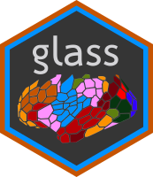
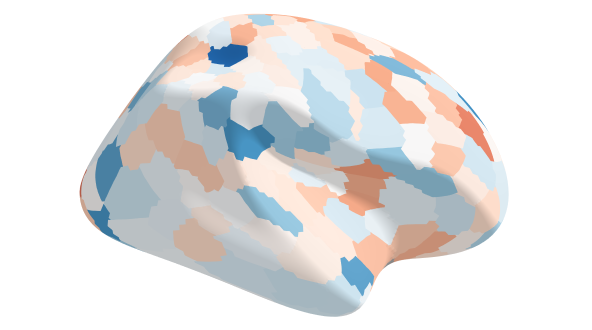
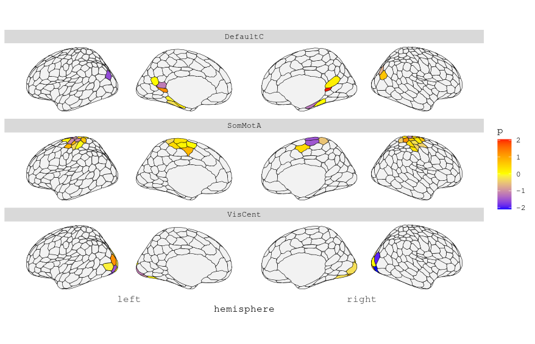

# glass 

The **glass** package is a set of wrappers around functions in the **ggseg** and **ggseg3d** packages designed to make certain kinds of surface plots simpler by handling some of the necessary data manipulation automatically. The package is in early progress, and is at the moment geared towards the use of the Schaefer parcellation provided by **ggsegSchaefer**.

Functions in **glass** accept a dataframe as input, containing ROI labels and other optional variables for grouping or plotting. For convenience, the package includes dataframes with the necessary structure (currently only schaefer17_400), which can be fed to a plotting function after appending a variable to be plotted. 

For example, an interactive 3D surface plot can be generated as follows:

```r
data <- LoadAtlasInformation('schaefer17_400')
data$p <- rnorm(nrow(data))

CortexPlot3d(data, atlas = schaefer17_400, surf = 'inflated', hemi = 'right', 
             fill = 'p', palette = 'r_RdBu', ncolor = 9, limits = NULL, 
             camera = 'right lateral')
```



Alternately, we can create a 2d surface plot of the same variable, facetted by network:

```{r}
subnet.data <- subset(data, Network %in% c('VisCent', 'SomMotA', 'DefaultC'))
CortexPlot2d(subnet.data, atlas = schaefer17_400, fill = 'p', groupby = 'Network', 
             color = 'black', size = .2) +
    facet_wrap(~ Network, ncol = 1) +
    scale_fill_gradient2(low = 'blue', mid = 'white', high = 'red', 
                         midpoint = 0, na.value = grey(.8)) 
```


